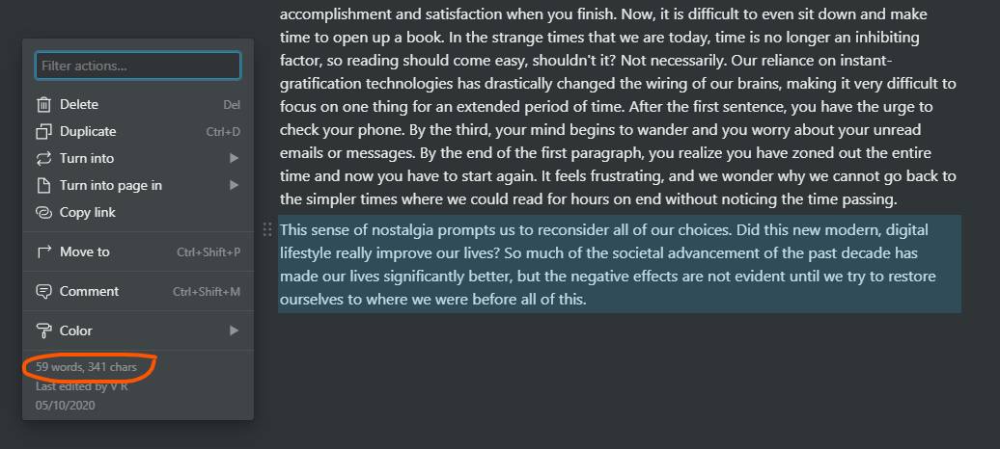

# Notion Word Count Chrome Extension

Notion has a word count for a whole page, but what if you want to check the number of words/characters in a selected block? This extension does just that.

This extension only has one content script. It simply grabs the element that is indicated as selected, gets the content of that block, finds the number of words/chars, and appends an element to the menus to display the relevant info, like this: 

## Install

- Find the latest release (right sidebar in Github) and download + extract the zip file. 
- Navigate to [`chrome://extensions`](chrome://extensions/) and press `Load unpacked` in the top left. Then, choose the `dist` folder from inside the extracted folder. The extension should be working now!

---
## Development
- Typescript
- JQuery (DOM manipulation)
- NPM (package management)
- Webpack (bundling)

## Install deps

```bash
npm install
```


## Build

```bash
npm run build
```

## Build in watch mode

```bash
npm run watch
```


## Load extension to chrome

Navigate to [`chrome://extensions`](chrome://extensions/) and press `Load unpacked` in the top left. Then, choose the `dist` folder. The extension should be working now!
