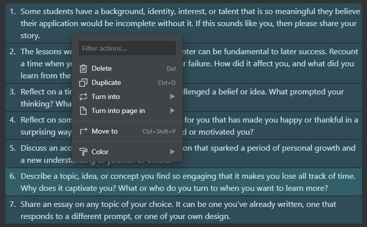

# ROADMAP

- [x] Set up chrome extension skeleton
- [x] Find selected element and get text
- [x] Implement counting words and characters
- [x] Show in left side modal (when clicking the dots to the left of a block)
- [x] Show in right click modal
  - [ ] Handle this separate modal: 
- [ ] Get selected text (via browser) when selecting text inside a block and render WC in small top side modal

- [ ] Explore making another extension for a Notion status bar (like in Word, VSCode) to show all sorts of relevant info